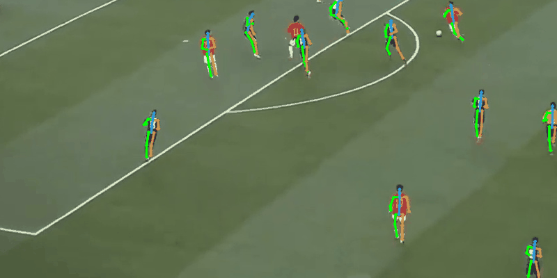
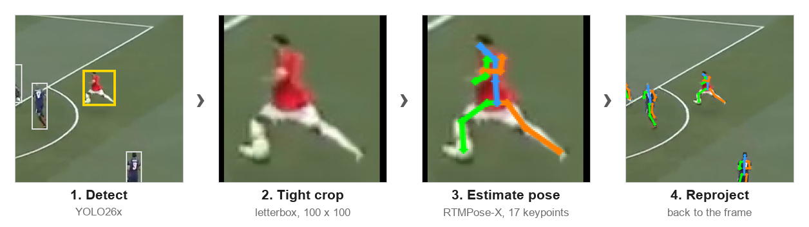

<div align="center">

# A Quantitative Pipeline for Soccer Player Pose Estimation in Broadcast Video

**From TV broadcast to player pose — with every design choice backed by an experiment**

Wagner Victor Alves de Menezes · Ricardo Augusto Pereira Franco · Raphael Alves de Lima Soares ·
Victor Gabriel Ribeiro Jacome · André Guilherme Alves do Carmo

Institute of Informatics, Federal University of Goiás (UFG), Brazil

[](https://github.com/WagnerVic/football-orient-pose/actions/workflows/ci.yml)
[](LICENSE)
[](pyproject.toml)
[](#citation)



<sub>Every player detected, cropped and posed, frame by frame, on a real broadcast (zero-shot RTMPose-X, CPU).</sub>

</div>

---

## Overview

Every televised match is a free, high-quality record of how players move: where they face, how
they strike the ball, how they keep their balance. Turning that footage into body pose would make
tactical and biomechanical analysis possible without wearables, sensors or special cameras — for
any club, federation or analyst with access to a TV broadcast.

Broadcast video, however, is a hostile domain for pose estimation. A player often occupies about
60 × 60 pixels, blurred by motion, partly hidden by other players and caught in poses that everyday
photos rarely show. Models trained on everyday images still find *where* a joint is, but miss its
exact position by a few pixels — and on a player that small, a few pixels separate a correct wrist
from a wrong one.

This project builds a complete pipeline for the problem and, instead of choosing components by
reputation, **lets experiments decide every stage**. Four person detectors are compared against
human annotations, three pose estimators are benchmarked on soccer shots, and the winner is adapted
to the domain in a controlled study that separates the effect of pretrained weights from the effect
of data augmentation. The adapted estimator is **25.8 points more precise** than the off-the-shelf
one — without new data and without a bigger model.

<div align="center">

| **84.4 mAP** | **41.8% → 67.5%** | **1.1 pp** | **1 command** |
|:---:|:---:|:---:|:---:|
| best of four person detectors<br>(YOLO26x) | PCK@0.2 of RTMPose-X,<br>off-the-shelf → adapted | train–validation gap<br>of the adapted model | to run the pipeline<br>on your own video |

</div>

## Key findings

- **The bottleneck is localization, not detection.** Off-the-shelf RTMPose-X finds the right body
  region for 93.6% of the joints (PDJ@0.5) but places only 41.8% of them precisely (PCK@0.2).
- **Domain adaptation, not model capacity, closes the gap.** Fine-tuning from COCO weights with
  data augmentation reaches 67.5% PCK@0.2 with almost no overfitting, and is the only setting that
  brings elbows, wrists, knees and ankles above the off-the-shelf level.
- **Pretrained weights and augmentation are complementary.** Starting from COCO weights beats
  training from scratch at every augmentation level (+15.1 pp without augmentation, +9.4 pp with
  it), and augmentation helps both (+20.3 pp from scratch, +14.7 pp from COCO). Neither alone gets
  close to the combination.
- **What augmentation really buys is geometry.** Horizontal flip plus rotation, scale and shift
  account for about 90% of the augmentation gain; synthetic occlusion and motion blur add about
  0.7 pp each.

## How it works

<p align="center"></p>

Each frame goes through four stages. YOLO26x detects every person on the pitch; each box is cut
into a tight 100 × 100 crop with letterboxing (no distortion); RTMPose-X estimates 17 keypoints in
the [H3WB](https://github.com/wholebody3d/wholebody3d) layout used by 3DSP; the keypoints are mapped
back to frame coordinates. Detector and estimator sit behind common interfaces, so either can be
swapped without touching the rest of the pipeline.

| Stage | Module |
|---|---|
| Detection | [`detection.py`](src/football_orient_pose/detection.py) — YOLO26x, RetinaNet, Faster R-CNN, Cascade R-CNN |
| Tight crop | [`crop.py`](src/football_orient_pose/crop.py) — letterboxed crops and exact crop ↔ frame transforms |
| Pose | [`estimators/`](src/football_orient_pose/estimators/) — RTMPose-X (zero-shot or fine-tuned), HRNet-W48, OpenPose |
| Reprojection | [`pipeline.py`](src/football_orient_pose/pipeline.py) — `pose_all()` runs the whole chain for every player in a frame |

## Results

### Detector selection

740 player boxes hand-annotated on 60 broadcast frames; COCO metrics via `pycocotools`,
precision/recall/F1 at confidence ≥ 0.3 and IoU ≥ 0.5.

| Detector | mAP | AP50 | AP75 | AR<sub>medium</sub> | Precision | Recall | F1 |
|---|---:|---:|---:|---:|---:|---:|---:|
| **YOLO26x** | **84.4** | **95.0** | **91.6** | **87.5** | **98.7** | **95.4** | **97.0** |
| Cascade R-CNN | 68.3 | 90.7 | 77.5 | 73.8 | 54.5 | 93.4 | 68.9 |
| Faster R-CNN | 65.1 | 91.9 | 74.7 | 70.3 | 47.8 | 94.7 | 63.6 |
| RetinaNet | 61.9 | 91.1 | 70.3 | 68.2 | 57.3 | 93.7 | 71.1 |

The two-stage detectors reach similar recall but also detect spectators in the stands, which is
what drags their precision below 60%.

### Pose estimators, zero-shot (3DSP validation split, 800 crops)

| Model | PDJ@0.5 ↑ | PCK@0.2 ↑ | OKS ↑ | MPJPE-2D (px) ↓ |
|---|---:|---:|---:|---:|
| OpenPose | 56.1 | 22.1 | 48.5 | 25.58 |
| HRNet-W48 | 88.9 | 40.5 | 76.2 | 6.04 |
| **RTMPose-X** | **93.6** | **41.8** | **81.8** | **4.81** |

### Domain adaptation: transfer learning × data augmentation

RTMPose-X trained on the 3DSP training split (160 clips, split by clip to avoid leakage), from COCO
weights (transfer learning, with progressive unfreezing) or from random weights, with or without
augmentation. Same protocol for every cell: batch 64, AdamW, 150 epochs, best checkpoint by PCK@0.2.

| Setting | Init | Augmentation | PCK@0.2 ↑ | PDJ@0.5 ↑ | OKS ↑ | MPJPE-2D (px) ↓ | Train–val gap |
|---|---|---|---:|---:|---:|---:|---:|
| Zero-shot | COCO | — | 41.8 | 93.6 | 81.8 | 4.81 | — |
| A | random | none | 37.8 | 86.5 | 74.5 | 6.76 | — |
| B | random | full | 58.1 | 93.6 | 85.3 | 4.09 | 37.1 pp |
| C | COCO | none | 52.9 | 91.5 | 82.2 | 4.80 | 12.2 pp |
| **D-FULL** | **COCO** | **full** | **67.5** | **96.6** | **89.8** | **3.08** | **1.1 pp** |

"Full" augmentation is an additive ladder: horizontal flip → geometric (rotation ±30°, scale
0.75–1.25, shift 0.1) → occlusion → motion blur.

<details>
<summary>PCK@0.2 per body part</summary>

| Part | Zero-shot | C (transfer only) | B (augmentation only) | **D-FULL** |
|---|---:|---:|---:|---:|
| Head | 50.4 | 73.9 | 87.6 | **89.5** |
| Shoulder | 30.4 | 64.9 | 70.5 | **78.4** |
| Elbow | 50.8 | 39.4 | 42.6 | **56.4** |
| Wrist | 43.5 | 31.0 | 33.6 | **46.1** |
| Hip | 22.8 | 54.5 | 60.2 | **69.3** |
| Knee | 58.3 | 47.3 | 53.5 | **64.8** |
| Ankle | 59.4 | 51.6 | 54.0 | **67.2** |

Only the combination of transfer learning and augmentation lifts the extremities above zero-shot.

</details>

## Model zoo

| Model | Init | Augmentation | PCK@0.2 | PDJ@0.5 | OKS | MPJPE-2D | Config | Weights |
|---|---|---|---:|---:|---:|---:|---|---|
| RTMPose-X zero-shot | COCO | — | 41.8 | 93.6 | 81.8 | 4.81 px | — | downloaded automatically by `rtmlib` |
| **RTMPose-X D-FULL** | COCO | full | **67.5** | **96.6** | **89.8** | **3.08 px** | [`cenario_d.py`](configs/cenario_d.py) | coming soon in [Releases](https://github.com/WagnerVic/football-orient-pose/releases) |

The other eight models of the study (A, B, C and the augmentation ladder) can be retrained with the
commands in [Reproducing the paper](#reproducing-the-paper).

## Installation

Requires Python ≥ 3.11 and [uv](https://github.com/astral-sh/uv).

```bash
git clone https://github.com/WagnerVic/football-orient-pose.git
cd football-orient-pose
uv sync
```

This installs everything needed for inference and evaluation (PyTorch, Ultralytics, rtmlib with
ONNX Runtime — the CUDA build on Linux x86-64 and Windows, the CPU build elsewhere).

Fine-tuning uses a pinned MMPose stack in a separate environment:

```bash
make finetuning-env          # creates .venv-mmpose (MMEngine, MMCV 2.2, MMPose, MMDetection)
# or, on a GPU host:
make docker-build            # image football-finetuning:latest
```

## Quick start

Run the full pipeline on a video or an image:

```bash
uv run python demo.py --input data/examples/test_00001.mp4
```

The annotated video is written to `outputs/test_00001_pose.mp4` (`make demo` does the same). The first run downloads the
YOLO26x and RTMPose-X weights. Useful options:

| Option | Effect |
|---|---|
| `--json` | also save boxes and the 17 H3WB keypoints of every player per frame |
| `--max-frames N` | process only the first N frames |
| `--device cuda` | run on GPU (default: GPU if available, otherwise CPU) |
| `--pose finetuned --checkpoint d_full.pth` | use a fine-tuned model (needs the MMPose environment) |

Or from Python:

```python
import cv2
from football_orient_pose.detection import YOLO26Detector, detections_to_arrays
from football_orient_pose.estimators.rtmpose import RTMPoseEstimator
from football_orient_pose.pipeline import pose_all

frame = cv2.imread("frame.jpg")
boxes, _ = detections_to_arrays(YOLO26Detector("yolo26x.pt").detect(frame))
players = pose_all(frame, boxes, RTMPoseEstimator(), min_box_height=40)
players[0].keypoints_frame  # (17, 2) keypoints in frame pixels
```

## Data

- **3DSP** ([Yeung et al., CVPRW 2024](https://github.com/calvinyeungck/3D-Shot-Posture-Dataset)):
  4,000 crops of soccer shots with 17 hand-annotated 2D keypoints. Download `3dsp.zip` from the
  official repository into the project root and run `make setup` to extract it into `data/`. The
  train/validation split used in the paper (80/20 by clip, seed 42) is fixed in
  [`configs/split.json`](configs/split.json).
- **Detector ground truth**: 740 person boxes on 60 frames, in
  [`data/annotations/examples_bbox/`](data/annotations/examples_bbox/) (COCO format).
- **Broadcast clips** used for the qualitative results: [`data/clips/`](data/clips/). The tools to
  cut new clips from any video are in [`scripts/clips/`](scripts/clips/).

## Reproducing the paper

| Result | Command |
|---|---|
| Detector benchmark | `make docker-eval-detector DET=yolo26 WEIGHTS=yolo26x.pt` (also `DET=faster-rcnn`, `DET=retinanet`, and `make docker-eval-cascade`), then `make docker-detectors-table` |
| Zero-shot estimators | `bash scripts/setup/download_models.sh`, then `uv run python -m football_orient_pose.evaluation.evaluate --model rtmpose` (or `hrnet`, `openpose`; add `--device cpu` without a GPU) |
| Fine-tuning A, B, C, D-FULL | `make finetuning-checkpoint`, then `make train-a` … `make train-d` (or `make docker-train CENARIO=D`) |
| Evaluate a fine-tuned model | `make evaluate CENARIO=D` (reads `results/checkpoints/cenario_D/best_PCK.pth`) |
| Augmentation ladder | inside the Docker image: `bash scripts/training/run_raw.sh` and `bash scripts/training/run_bd.sh` (epoch settings in each script's header) |
| Qualitative results | `make pose-all-brazil` (add `DEVICE=cpu` without a GPU), then `make gifs` |

All metrics reported in the paper are also stored as JSON in [`results/tables/`](results/tables/).
`make help` lists every target. The unit tests (`make test`) need no GPU and no data.

## Project structure

```
src/football_orient_pose/   library: detection, crop, pipeline, estimators/, evaluation/, finetuning/
scripts/                    command-line tools: clips/, evaluation/, pipeline/, setup/, training/
configs/                    MMPose configs of every fine-tuning setting + the fixed data split
demo.py                     one-command pipeline on a video or image
results/tables/             every reported metric, as JSON
docs/                       technical reports of each experiment (in Portuguese)
tests/                      unit tests (pytest)
```

## Citation

The paper reference will be added here once it is published. Until then, please cite the software
(GitHub's *Cite this repository* button uses [`CITATION.cff`](CITATION.cff)):

```bibtex
@software{menezes2026soccerpose,
  title  = {A Quantitative Pipeline for Soccer Player Pose Estimation in Broadcast Video},
  author = {Menezes, Wagner Victor Alves de and Franco, Ricardo Augusto Pereira and
            Soares, Raphael Alves de Lima and Jacome, Victor Gabriel Ribeiro and
            Carmo, Andr{\'e} Guilherme Alves do},
  year   = {2026},
  url    = {https://github.com/WagnerVic/football-orient-pose}
}
```

## Acknowledgements

This work builds on the [3DSP dataset](https://github.com/calvinyeungck/3D-Shot-Posture-Dataset)
(Yeung, Ide and Fujii, CVPRW 2024), [RTMPose and MMPose](https://github.com/open-mmlab/mmpose)
(OpenMMLab), [Ultralytics YOLO](https://github.com/ultralytics/ultralytics) and
[rtmlib](https://github.com/Tau-J/rtmlib). The detector–estimator pipeline design follows Reis et
al., *Soccer Player Pose Recognition in Games* (ICGG 2022), which this work extends with a
quantitative evaluation of every stage.

## License

The code in this repository is released under the [MIT License](LICENSE). Third-party components
keep their own licenses: Ultralytics YOLO is AGPL-3.0, MMPose/RTMPose and the 3DSP dataset are
Apache-2.0. Broadcast footage in `data/` belongs to its respective rights holders and is included
only to demonstrate the method.
