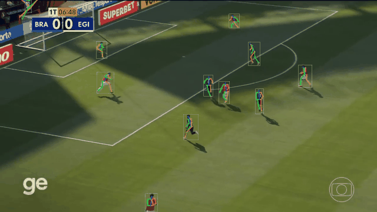

# football-orient-pose

Estimação de **pose** de jogadores de futebol a partir de vídeo de broadcast. Reproduz e **supera** o
baseline de **Reis et al. (2023)** — que fazia `YOLOv3 → crop → OpenPose`, validado só visualmente —
com um pipeline benchmarkado e **quantitativo**:

> **YOLO26x** (detector vencedor — Épico #113) → **crop justo** → **RTMPose-X fine-tunado no 3DSP**
> (PCK@0.2 **41,8% → 67,5%** — Épico 2) → esqueleto reprojetado no frame real.

Como o baseline, poseia **todos** os jogadores do campo (showcase automático). Diferente dele, tem
**métrica de keypoint** (PDJ/PCK/OKS/MPJPE) onde existe ground truth.



> 📊 Relatório completo do pipeline (com mais GIFs): [docs/vision/epic-126-pipeline.md](docs/vision/epic-126-pipeline.md) ·
> 🗺️ Mapa da documentação: [docs/README.md](docs/README.md)

## Setup

### 1. Dataset

Os datasets estão compactados em `.zip` para versionamento no Git. Após clonar o repositório:

**Linux / macOS**
```bash
make setup        # Descompacta os .zip para data/
make clean-data   # Remove data/ para re-extrair do zero
make help         # Lista os comandos disponíveis
```

**Windows (PowerShell)**
```powershell
.\setup_data.ps1          # Descompacta os .zip para data/
.\setup_data.ps1 -Clean   # Remove data/ para re-extrair do zero
```

> Se o PowerShell bloquear a execução, rode antes: `Set-ExecutionPolicy -Scope CurrentUser RemoteSigned`

Estrutura após extração:
```
data/
└── 3dsp/
    └── train/
        └── 00001/
            ├── img/       # Imagens dos jogadores (100×100 px)
            └── posture/   # Anotações de pose (JSON, formato H3WB-17)
```

### 2. Variáveis de ambiente

```bash
cp .env.example .env
# edite DATA_DIR se o dataset estiver em outro caminho
```

### 3. Pesos dos modelos

Os pesos não são versionados no Git (`models/weights/` está no `.gitignore`).
Execute o script abaixo para baixar todos os modelos:

```bash
bash scripts/setup/download_models.sh
```

O que o script faz por modelo:

| Modelo | Ação |
|--------|------|
| **RTMPose** | Nada — o `rtmlib` baixa automaticamente na 1ª inferência |
| **HRNet-W48** | Baixa `.zip` do Google Drive e descompacta o ONNX (~450 MB) |
| **OpenPose** | Pendente — upload no Drive em andamento |

> **Dependência:** o script usa `gdown` para baixar do Google Drive. Já incluído nas dependências do projeto (`uv sync` instala automaticamente).

---

## Estrutura do projeto

```
football-orient-pose/
│
├── configs/                  # Configs MMPose dos cenários de fine-tuning (cenario_*.py) + split.json
│
├── data/                     # Datasets — ignorado pelo Git (extraído dos .zip)
│   ├── 3dsp/                 # Dataset 3DSP (train/test): crops 100×100 + posture/ (H3WB-17)
│   ├── clips/                # Frames inteiros do broadcast: examples/ (3) + brazil/ (5)
│   └── crops/                # Crops justos do finalizador (insumo da anotação)
│
├── docs/                     # Documentação (ver docs/README.md)
│   ├── vision/               # Diferencial de visão: detector → crop → pipeline → showcase
│   └── finetuning/           # Fine-tuning RTMPose (Épicos 1–2, projeto RNP)
│
├── results/                  # Saídas — ignorado, exceto tables/ e showcase/gifs/
│   ├── showcase/gifs/        # GIFs do pipeline (versionados, embutidos nos docs)
│   ├── tables/               # Métricas JSON do benchmark
│   ├── training_runs/        # Logs e tabelas dos treinos de fine-tuning
│   └── checkpoints/          # Pesos .pth
│
├── scripts/
│   ├── pipeline/             # demo_examples, pose_all_players, make_gifs
│   ├── evaluation/           # eval_detectors, evaluate, detectors_table
│   ├── clips/                # Extração de clips (cut/download/validate)
│   └── training/  setup/     # Fine-tuning (train.py) + setup do ambiente/pesos
│
├── src/football_orient_pose/
│   ├── detection.py          # YOLO26Detector + interface unificada de detectores
│   ├── crop.py               # Crop justo (letterbox) + reprojeção frame↔crop
│   ├── pipeline.py           # Encadeamento detect→crop→pose (run_pipeline, pose_all)
│   ├── pose.py               # BasePoseEstimator (ABC — interface dos estimadores)
│   ├── estimators/           # rtmpose (zero-shot + fine-tunado), hrnet, openpose
│   ├── evaluation/           # Métricas de pose (PDJ/PCK/OKS/MPJPE) e de detecção
│   └── utils/                # viz (esqueleto/GIF), keypoint_mapping, skeleton, data_io, ...
│
├── tests/                    # 139 testes unitários
├── Makefile                  # Comandos do projeto (make help)
└── pyproject.toml
```

---

## Avaliação

```bash
# Avaliar um modelo no split de validação
uv run python -m football_orient_pose.evaluation.evaluate \
  --model rtmpose \
  --split val \
  --device cuda \
  --data-dir data \
  --split-config configs/split.json \
  --output-dir results/tables
```

| Modelo | PDJ@0.5 | Referência (paper) |
|--------|---------|-------------------|
| RTMPose-X | **93.62%** | 89.51% |
| HRNet-W48 | **88.90%** | ~56.08% |
| OpenPose  | — | inédito |

---

## Fine-tuning (Épico 1)

Infraestrutura para treinar o RTMPose-X nos 4 cenários da matriz experimental 2×2
(From Scratch vs Transfer Learning × Com vs Sem augmentation) e avaliar checkpoints
com PDJ@0.5, PCK@0.2, OKS e MPJPE-2D.

### Setup — Build da imagem Docker

Requer Docker + NVIDIA Container Toolkit (GPU). Os pesos COCO para Transfer Learning
são baixados automaticamente durante o build.

```bash
docker compose -f docker-compose.finetuning.yml build
```

Ou pull da imagem pré-buildada:

```bash
docker pull phael777/football-finetuning:latest
```

### Treino — Cenários individuais

```bash
# Cenário A — From Scratch, sem augmentation (baseline)
docker compose -f docker-compose.finetuning.yml run --rm train \
    python scripts/training/train.py --cenario A --epochs 50

# Cenário B — From Scratch, com augmentation
docker compose -f docker-compose.finetuning.yml run --rm train \
    python scripts/training/train.py --cenario B --epochs 50

# Cenário C — Transfer Learning, sem augmentation [ALTA PRIORIDADE]
docker compose -f docker-compose.finetuning.yml run --rm train \
    python scripts/training/train.py --cenario C \
    --epochs-fase1 15 --epochs-fase2 20 --epochs-fase3 15

# Cenário D — Transfer Learning, com augmentation
docker compose -f docker-compose.finetuning.yml run --rm train \
    python scripts/training/train.py --cenario D \
    --epochs-fase1 15 --epochs-fase2 20 --epochs-fase3 15
```

### Treino — Todos os cenários em sequência

```bash
for CENARIO in A B C D; do
  docker compose -f docker-compose.finetuning.yml run --rm train \
    python scripts/training/train.py --cenario $CENARIO
done
```

### Treino orquestrado A + C (fire-and-forget) — usado nos experimentos

`scripts/training/run_experiments.sh` roda os Cenários A e C de ponta a ponta
(treino → avaliação train/val de cada um → resumo consolidado) num container
**destacado** (`-d`), que sobrevive à queda da sessão SSH. Foi este o comando usado
para gerar os resultados abaixo (RTX 4090, GPU via CDI — `--gpus all`, sem sudo):

```bash
cd ~/football-orient-pose && git pull   # garante o código atualizado no host

docker run -d --name exp --gpus all --shm-size=16g \
  -v ~/football-orient-pose/data:/workspace/data:ro \
  -v ~/football-orient-pose/results:/workspace/results \
  -v ~/football-orient-pose/scripts:/workspace/scripts:ro \
  -v ~/football-orient-pose/configs:/workspace/configs:ro \
  -v ~/football-orient-pose/src:/workspace/src:ro \
  -e EPOCHS_A=200 -e F1=60 -e F2=80 -e F3=60 \
  football-finetuning:latest bash scripts/training/run_experiments.sh
```

Parâmetros (via `-e`): `EPOCHS_A` (épocas do A), `F1/F2/F3` (épocas das 3 fases do C),
`BATCH` (default 32). Sem `-e`, usa os defaults `EPOCHS_A=150`, `F1/F2/F3=45/60/45`.

Acompanhar o progresso e ver os resultados:

```bash
docker logs -f exp                            # log ao vivo (Ctrl+C só para de seguir; o treino continua)
docker ps -a | grep exp                       # status: "Up" = rodando | "Exited (0)" = terminou ok

cat results/logs/exp_*/SUMMARY.md             # tabela consolidada A vs C (val + diagnóstico train/val)
ls  results/logs/exp_*/                        # logs por etapa: train_A.log, eval_A_val.log, ...
ls  results/tables/finetuned_cenario_*.json    # as 4 métricas por cenário e split (train/val)
```

Os checkpoints (`results/checkpoints/`) e os logs/JSONs (`results/`) ficam no host
mesmo após remover o container (`docker rm exp`).

### Avaliação de checkpoint

```bash
# Avaliar um checkpoint no val split
docker compose -f docker-compose.finetuning.yml run --rm train \
    python scripts/evaluation/evaluate.py \
    --checkpoint results/checkpoints/cenario_C/best_PCK.pth \
    --split val

# Avaliar todos os cenários treinados
for CENARIO in A B C D; do
  docker compose -f docker-compose.finetuning.yml run --rm train \
    python scripts/evaluation/evaluate.py \
    --checkpoint results/checkpoints/cenario_${CENARIO}/best_PCK.pth \
    --split val
done
```

Checkpoints salvos em `results/checkpoints/cenario_{A,B,C,D}/best_PCK.pth`.
Métricas salvas em `results/tables/finetuned_cenario_{A,B,C,D}_val.json`.

### Resultados (Épico 2 — fine-tuning RTMPose-X)

O fine-tuning no 3DSP elevou o **PCK@0.2 de 41,8% (zero-shot) para 67,5%** — receita campeã: Transfer
Learning + augmentation (geométrica + oclusão), com as extremidades (punhos/tornozelos) resolvidas. A
tabela completa (PDJ/PCK/OKS/MPJPE dos 10 modelos da matriz 2×2) está no relatório final:

[docs/finetuning/epico-2/epic2-relatorio-final.md](docs/finetuning/epico-2/epic2-relatorio-final.md)
